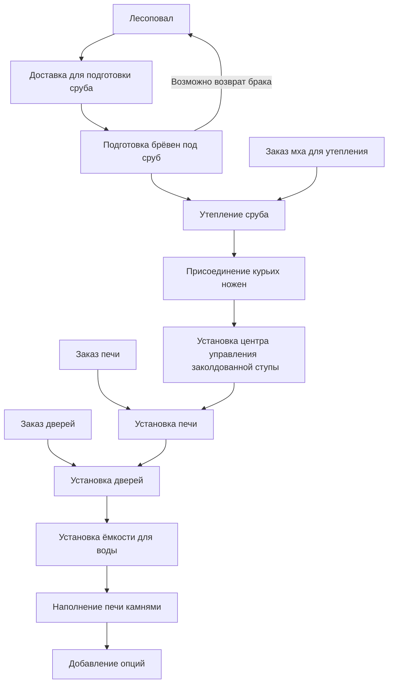
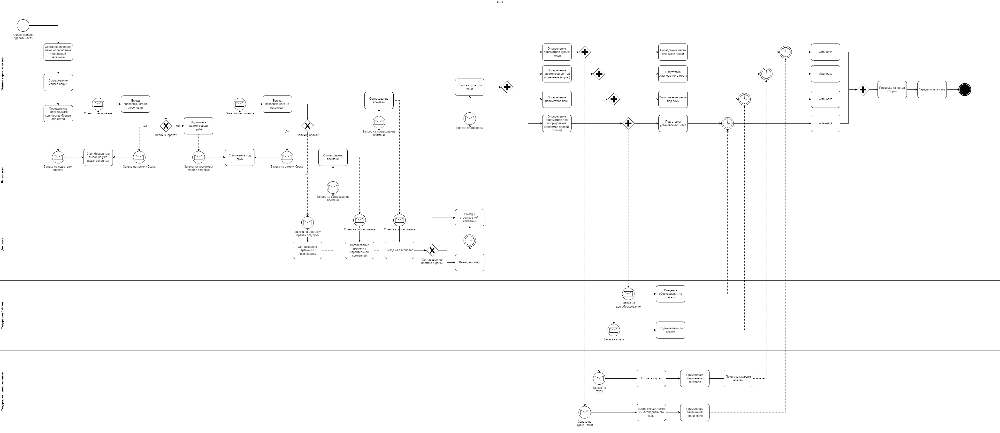
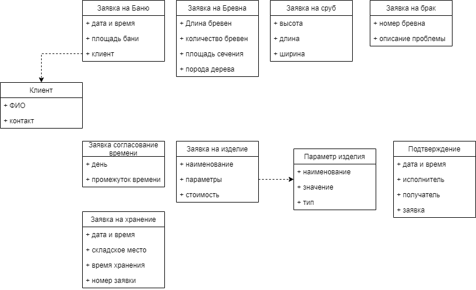
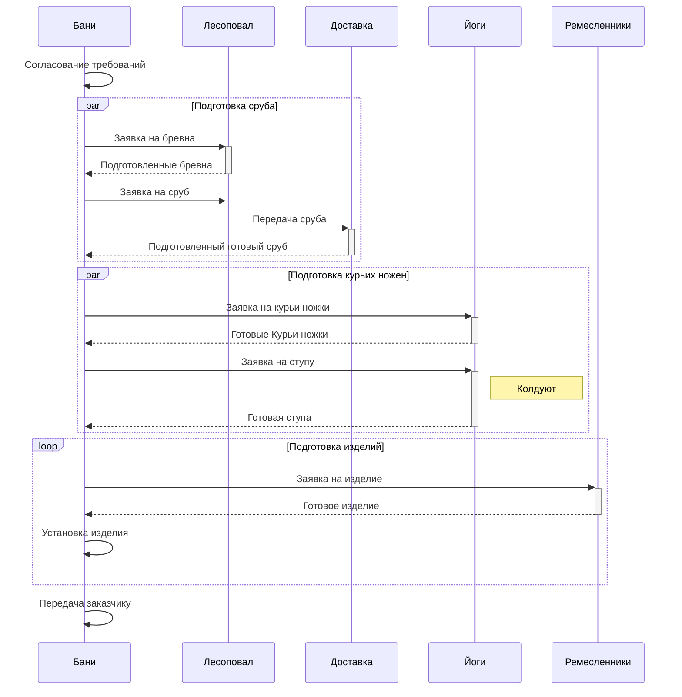

# Методология программной инженерии (Software engineering methodology)

## Авторы

- [Евгений Гурин](https://github.com/GulDilin)
- [Павел Ефаринов](https://github.com/PavelEfarinov)
- [Ксения Камышанская](https://github.com/kamyshks)

Идея по автоматизации какой-либо выдуманной системы

### Тема: Автоматизация производства передвижных бань на курьих ножках в княжестве Новгородском

[Vision](./vision.pdf)

[Software Requirements Specification](./Software_Requirements_Specification.pdf)

[Glossary](./Glossary.pdf)

[Risk List](./Risk_List.pdf)

[Use Case Specification](./Use_Case_Specification.pdf)

[Use Case Diagram drawio](./UseCases.drawio)

[Software Development Plan](./Software_Development_Plan.pdf)

[Software Development Plan Excel table](./Software_Development_Plan.xlsx)

## Прототип проекта

[Backend](https://github.com/GulDilin/itmo-SEM-back)

[Frontend](https://github.com/GulDilin/itmo-SEM-front)

Используемые технологии (backend):
- Python 3.8 (https://www.python.org/downloads/release/python-3810/)
- FastApi (https://fastapi.tiangolo.com/)
- poetry >= 1.4.1 (https://python-poetry.org/)

- PostgreSQL (https://www.postgresql.org/)
- Docker >= 20.10 (for dev) (https://www.docker.com/)
- Docker compose >= 2.15 (for dev) (https://www.docker.com/)
- Keycloak 20 (https://www.keycloak.org/)

Используемые технологии (frontend):
- Vue js 3 (https://vuejs.org/)
- Vue router (https://router.vuejs.org/)
- Vite (https://vitejs.dev/)
- Tailwindcss (https://tailwindcss.com/)
- Vuetify (https://vuetifyjs.com/en/)


### Идея бизнес процесса



### Состав бани

- Сруб
- Мох
- Крыша, кровля
- Скамьи
- Пол
- Лежаки
- Дверь
- Окно
- Печь
- Труба
- Камни
- Емкость для воды
- Курьи ножки
- Ступа заколдованная

Опции

- черпаки
- ведра
- вместимость бани
- размер ступы
- максимальная скорость
- полотенца
- веники
- ящики
- усиленная подвеска для крупных господ
- кол-во окон
- стол

## Лабораторная работа №2


### Разработка бизнес процесса (BPMN диаграмма)


### Описание передаваемых данных


### Sequence Diagram


## Инструменты для создания диаграмм

### Скрипт экспорта

- Установить draw.io
- Добавить путь к draw.io в path


```shell
chmod u+x export-diagrams.sh
./export-diagrams.sh
```

### Mermaid
https://github.com/mermaid-js/mermaid-cli

Установка
```
npm install -g @mermaid-js/mermaid-cli
```

Конвертация диаграммы в svg
```
mmdc -i input.mmd -o output.svg
```
