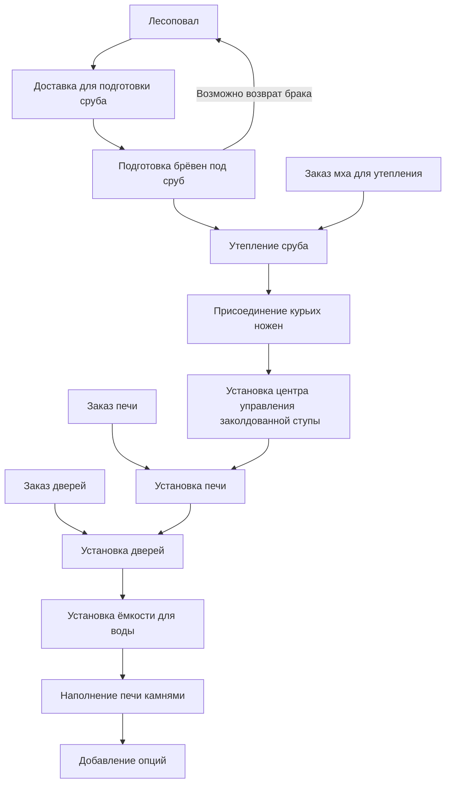
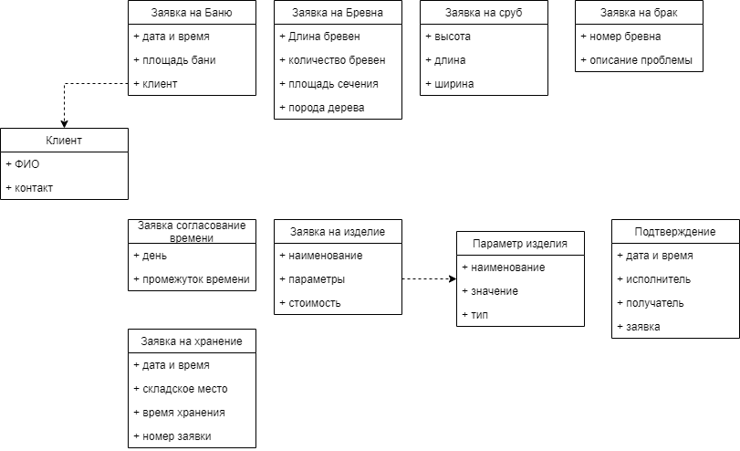
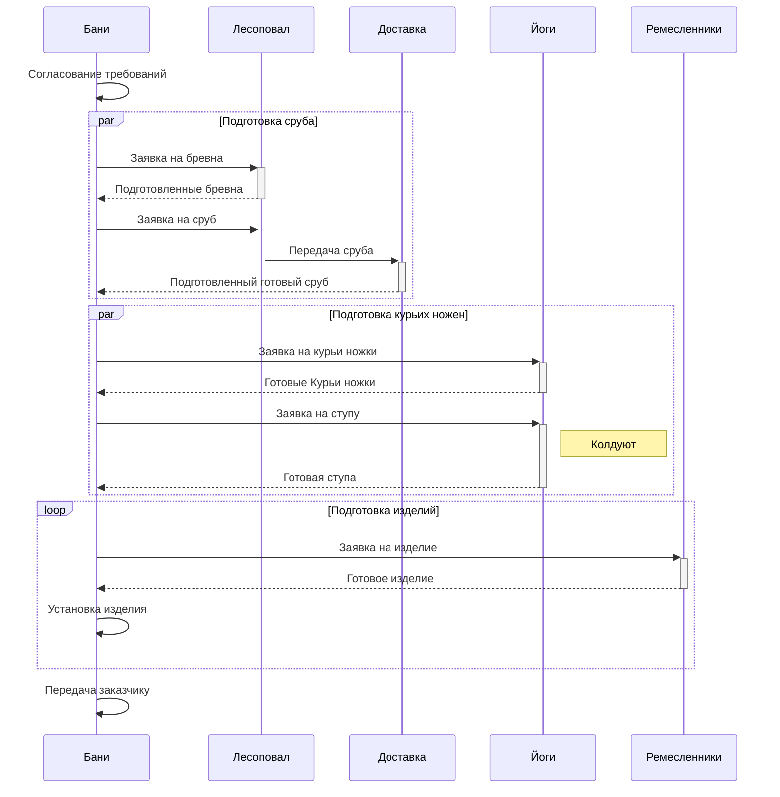

# Методология программной инженерии (Software engineering methodology)

## Лабораторная работа №1

Идея по автоматизации какой-либо выдуманной системы

### Тема: Автоматизация производства передвижных бань на курьих ножках в княжестве Новгородском

### Идея бизнес процесса

### Состав бани

- Сруб
- Мох
- Крыша, кровля
- Скамьи
- Пол
- Лежаки
- Дверь
- Окно
- Печь
- Труба
- Камни
- Емкость для воды
- Курьи ножки
- Ступа заколдованная

Опции

- черпаки
- ведра
- вместимость бани
- размер ступы
- максимальная скорость
- полотенца
- веники
- ящики
- усиленная подвеска для крупных господ
- кол-во окон
- стол

## Лабораторная работа №2

### Разработка бизнес процесса (BPMN диаграмма)

### Описание передаваемых данных

### Sequence Diagram

